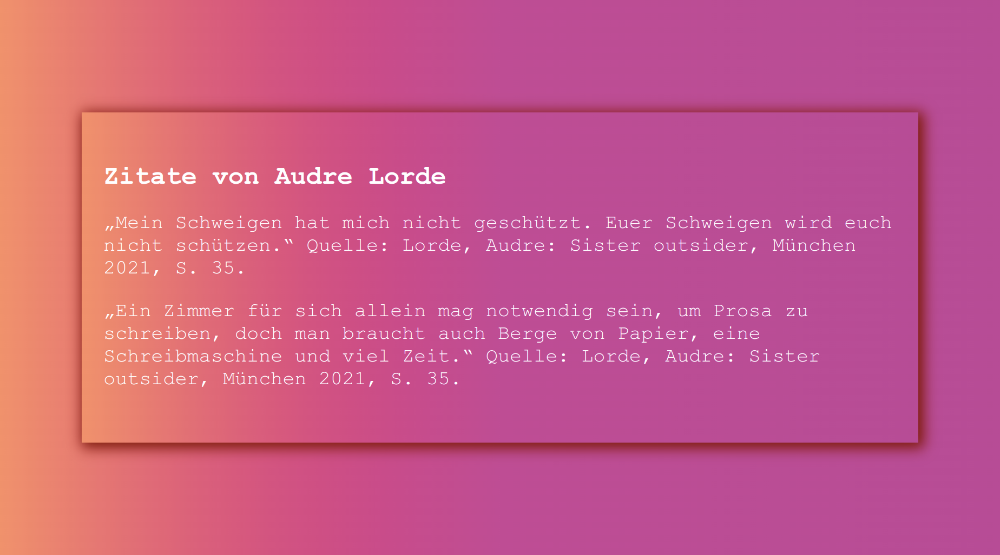
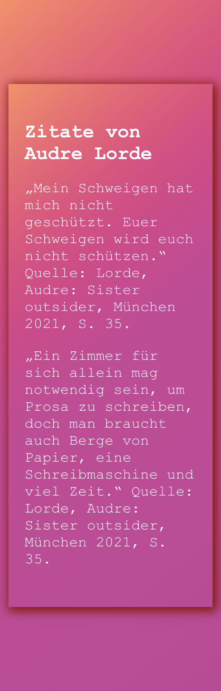
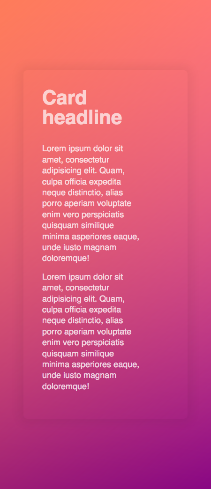

# Quotes from Audre Lorde - an elevated card effect

## Kurs-Modul 1 - UserInterfaceBasics (UIB) - HTML/CSS

created at 06.09.2022;

solved exercise: using CSS properties for creating an responsive webpage with 3D effect and color gradient as close as possible to the mockups;

#### My desktop version:

#### My mobile version:

#### Desktop mockup

#### Mobile mockup

